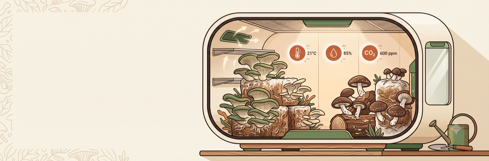
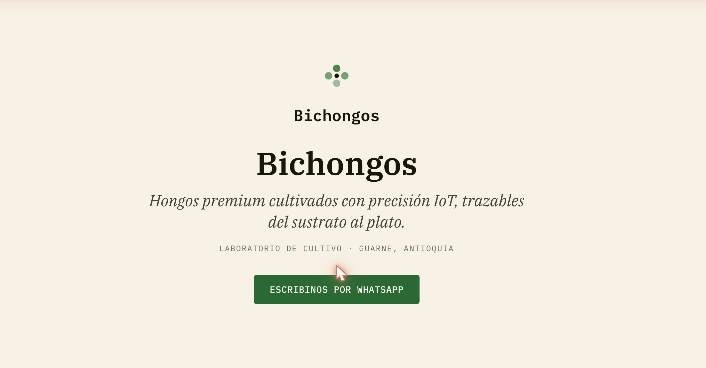
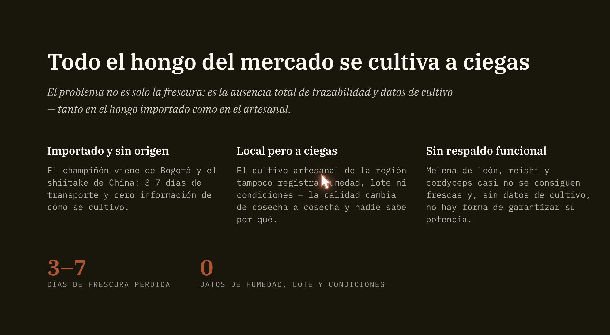
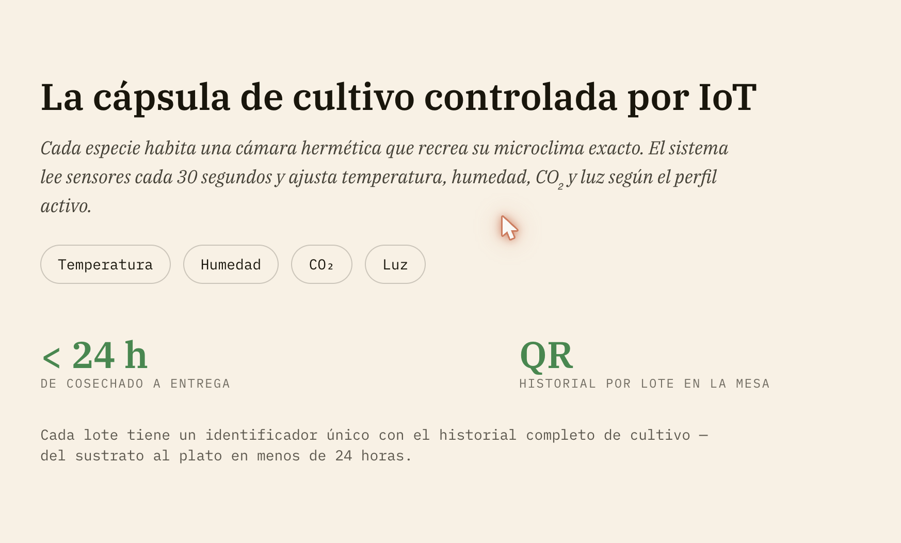
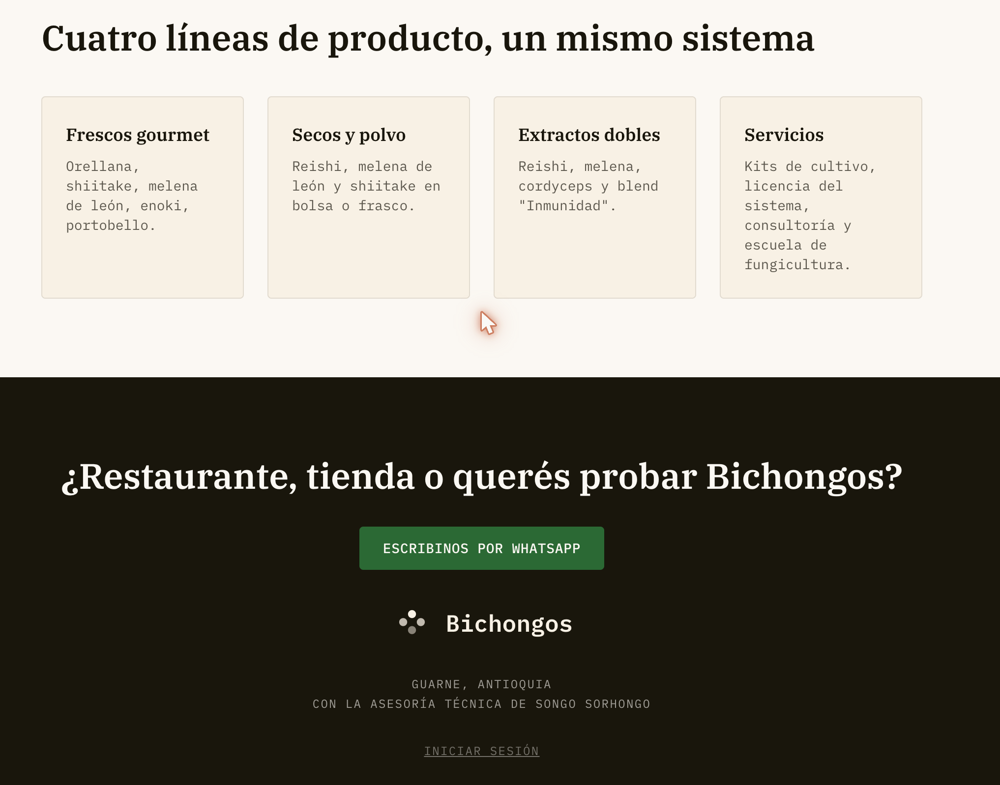
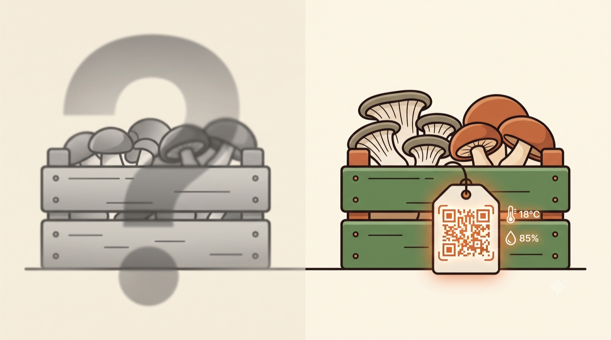
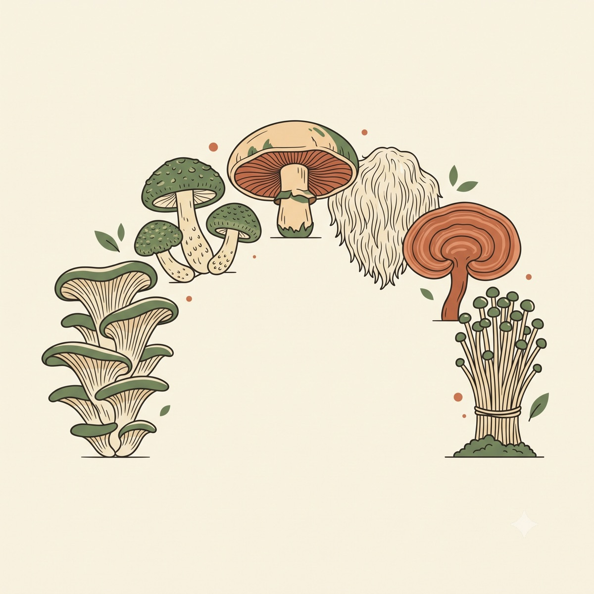

# Bichongos

Landing pública y (próximamente) panel de administración para **Bichongos**, un proyecto de cultivo de hongos gourmet y funcionales con trazabilidad IoT, en Guarne, Antioquia.

**🔗 [bichongos.store](https://bichongos.store)**



## Capturas

| Hero | El problema |
|---|---|
|  |  |

| Cómo funciona | Producto + contacto |
|---|---|
|  |  |

## Sobre el proyecto

Bichongos es un proyecto de **Juan Ballesteros** y **Daniela Arango**, con la asesoría técnica de **Songo Sorhongo** (laboratorio de cultivo con trazabilidad IoT, dirigido por María Isabel Álvarez Vera y Sergio Monsalve). El sitio resuelve dos necesidades: presentar el proyecto al público (landing) y darle a las personas capacitadas un panel para administrar el cultivo día a día.

El problema que resuelve: el hongo disponible en el mercado —importado o artesanal— se cultiva "a ciegas", sin trazabilidad ni datos de cultivo. Bichongos cultiva en cápsulas controladas por IoT (temperatura, humedad, CO₂, luz) con trazabilidad completa por lote vía QR.



Diseñé y construí esto de punta a punta: arquitectura, base de datos, autenticación, sistema de diseño y despliegue, con **asistencia de Claude Code** en todo el proceso — desde la investigación contra documentación viva hasta la revisión de código y seguridad en cada entrega.

### El sistema detrás: cápsulas de cultivo controlado por IoT

La base técnica que este panel administra es un sistema de **cápsulas de bajo costo con control total de temperatura, humedad, CO₂ y luz**, que permite cultivar cualquier especie de hongo (gourmet, funcional o medicinal) independientemente del clima local — cada especie tiene un *perfil de cepa* con sus parámetros exactos por etapa (incubación, fructificación), y el mismo perfil es reproducible en cualquier cápsula, en cualquier sede.



El diseño, firmware (ESP32) y protocolos de cultivo de ese sistema son investigación y desarrollo propios de Sergio Monsalve, documentados en un repositorio aparte: **[serandmoncas/Bichongos](https://github.com/serandmoncas/Bichongos)**. Este repo (`bichongos.store`) es la capa de producto — landing pública y panel de administración — que se apoya en esa base técnica.

## Stack técnico

- **Frontend:** Next.js 16 (App Router) + TypeScript + Tailwind CSS v4
- **Backend / Auth / DB:** Supabase (Postgres, Row Level Security, Auth con Google OAuth)
- **Deploy:** Vercel, dominio propio, CI/CD automático desde `main`
- **Identidad visual:** sistema de diseño propio — tokens de color en oklch, tipografía IBM Plex Serif/Mono, logo SVG con 4 variantes

## Highlights técnicos

Algunas decisiones y hallazgos de los que estoy particularmente conforme:

- **RLS auditada en profundidad.** Durante la implementación de roles, una revisión encontró y corrigió dos vulnerabilidades reales antes de producción: una policy que permitía a cualquier usuario auto-asignarse el rol `admin`, y una recursión infinita en las políticas de administrador que hubiera roto todas las consultas a la tabla de perfiles. Ambas resueltas — la primera con un trigger que bloquea cambios de rol no autorizados, la segunda con una función `SECURITY DEFINER` que rompe la recursión sin abrir huecos de seguridad.
- **Autenticación construida contra documentación viva, no memoria.** Next.js reemplazó `middleware.ts` por una nueva convención `proxy.ts`, y Supabase recomienda `getClaims()` (validación de JWT local) en vez de `getUser()`/`getSession()`. Verifiqué ambos contra la documentación actual y el código fuente de los paquetes instalados antes de implementar, en vez de confiar en conocimiento desactualizado.
- **Gate de autorización fail-closed.** El panel `/admin` es compartido por tres roles, no solo admin. Un escáner de seguridad automático sugirió una corrección que hubiera roto el acceso de los otros dos roles legítimos; en cambio identifiqué y corregí el bug real (un perfil no resuelto fallaba *abierto*, otorgando acceso en vez de negarlo).
- **Contraste WCAG AA verificado matemáticamente.** Los colores de marca se revisaron con cálculos de contraste reales (oklch → luminancia relativa vía la fórmula del W3C), no a ojo — encontré y corregí un botón que fallaba el umbral AA para texto normal.
- **Todo el flujo de login probado en vivo end-to-end** antes de dar por cerrada la funcionalidad: creación automática de perfil, gate por rol en ambos sentidos, y logout.

## Estructura del proyecto (por épicas)

- ✅ **Épica 1 — Fundaciones**: Next.js + TypeScript, Supabase, deploy en Vercel, modelo de datos inicial
- ✅ **Épica 2 — Landing pública**: hero, propuesta de valor, "cómo funciona", producto, SEO, responsive y accesibilidad
- ✅ **Épica 3 — Autenticación y roles**: login con Google, protección de rutas, roles y aprobación manual
- 🚧 **Épica 4 — Panel de administración**: gestión de usuarios y roles
- ⏳ Épicas 5-8: gestión del cultivo, capacitación, IoT/telemetría, calidad y operación

## Desarrollo local

```bash
npm install
npm run dev
```

Variables de entorno necesarias en `.env.local` (ver `.env.example`):

```
NEXT_PUBLIC_SUPABASE_URL=
NEXT_PUBLIC_SUPABASE_ANON_KEY=
```
